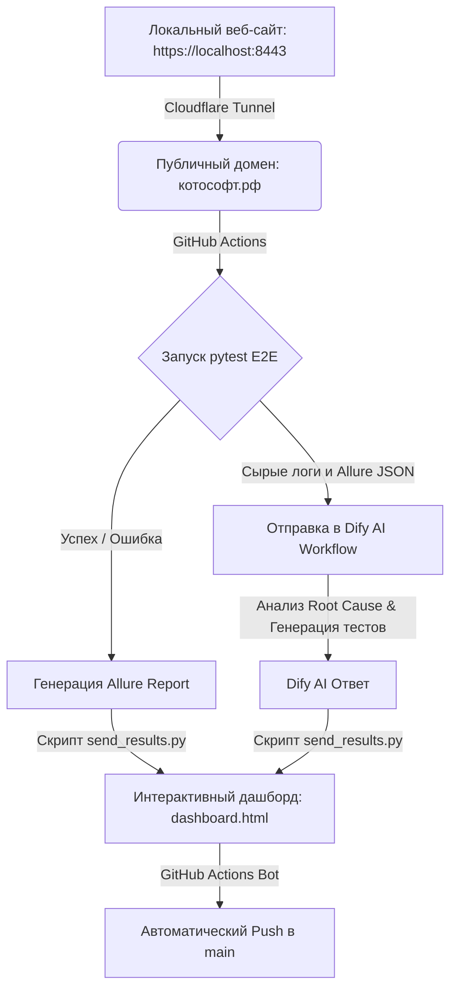

# 🐱 КотоСофт — Автоматизированный QA-Пайплайн (Курсовая работа)

Данный репозиторий представляет собой **курсовую работу**, посвященную разработке и тестированию веб-сайта **КотоСофт** (`xn--j1aiaaoedp.xn--p1ai` / `котософт.рф`), выполненного в ретро-стиле Windows 95 Miami Style, а также созданию полностью автоматизированного сквозного пайплайна тестирования (E2E) с интеграцией искусственного интеллекта (Dify AI).

---

## 🏗️ Архитектура системы и Пайплайна

Пайплайн сочетает локальную инфраструктуру веб-сайта, облачный туннель, автотесты на Playwright и AI-анализ результатов.



---

## 🛠️ Компоненты пайплайна

### 1. Тестируемый веб-сайт (`котософт.рф`)
* Работает локально на защищенном веб-сервере Nginx.
* Безопасно проброшен в интернет через **Cloudflare Tunnel**, что позволяет GitHub Action-раннерам обращаться к нему по публичному punycode-домену `http://xn--j1aiaaoedp.xn--p1ai`.

### 2. Слой автоматизированного тестирования
* **Playwright + Pytest**: Выполняет UI/E2E-тестирование (проверка доступности сайта, кликабельности плиток программ, наличия ключевых слов, воспроизведения анимации салюта при клике).
* **Скрипт патчинга тестов (`patch_tests.py`)**: Динамически модифицирует сгенерированные AI-тесты перед запуском в CI. Он:
  * Делает проверку текстов регистронезависимой (для обхода опечаток и стилизации сайта).
  * Автоматически вызывает `window.restoreWindow()` для разворачивания свернутых окон Windows 95.
  * Исправляет локаторы салютов и анимации.
* **Обход SSL (`conftest.py`)**: Playwright настроен на игнорирование ошибок самоподписанных SSL-сертификатов (`ignore_https_errors = True`).

### 3. Интеграция с ИИ (Dify AI Workflow)
* **Анализ Root Cause (RCA)**: При падении тестов ИИ анализирует сырые логи выполнения и структуры Allure JSON, формируя отчет об истинной причине падения (баг верстки, опечатка, недоступность селектора).
* **Генерация тестов на лету**: Dify принимает требования к ПО и генерирует код автотеста в реальном времени.

### 4. Веб-интерфейс отчетности (`dashboard.html`)
* **Автономность**: Локальный HTML-дашборд не требует базы данных и работает на встроенном JSON-хранилище (`LOCAL_DATA`).
* **Разделы**:
  * **Overview**: Статистика и шаги последнего запуска.
  * **Test Runs**: Полная история запусков пайплайна (до 15 последних запусков).
  * **Dify AI Analysis**: Структурированный AI-отчет об ошибках.
  * **Source Code**: Просмотр исходного кода тестов и скриптов прямо в дашборде.

---

## 🚀 Инструкция по запуску

### Запуск тестов локально
1. Установите зависимости:
   ```bash
   pip install -r requirements.txt
   python -m playwright install --with-deps chromium
   ```
2. Запустите тесты:
   ```bash
   pytest --alluredir=allure-results
   ```

### Запуск пайплайна в CI (GitHub Actions)
Пайплайн запускается автоматически при событии `repository_dispatch` (когда Dify Workflow отправляет сгенерированные тесты и требования на GitHub):

1. Шаг валидации кода проверяет синтаксис присланного теста.
2. `patch_tests.py` адаптирует тесты под интерфейс Windows 95.
3. Запускается pytest с логированием в `pytest_execution.log`.
4. Результаты отправляются обратно в Dify API, а также упаковываются в `dashboard.html`.
5. GitHub Actions автоматически делает коммит обновленного дашборда обратно в репозиторий с меткой `[skip ci]`.
